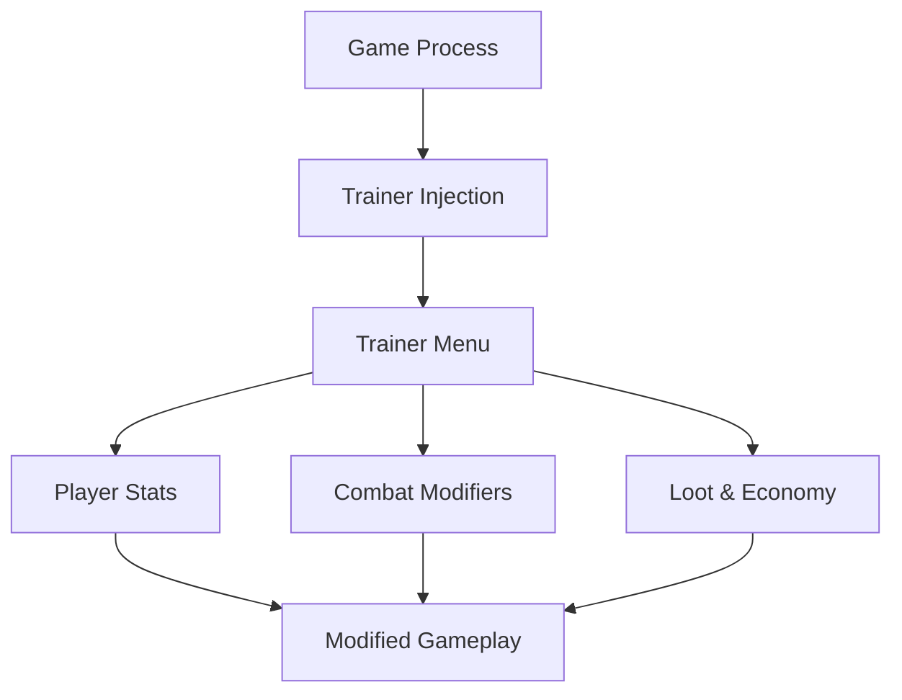

# Dead Island 2 Trainer

Dead Island 2 doesn’t whisper.
It *splashes*.

Blood arcs through neon streets, bones argue with physics, and every fight is a loud conversation between panic and power. **Dead Island 2 Trainer** steps into that noise not as a cheat — but as a **control panel for carnage**.

Not to end the madness.
To *conduct* it.

[](https://dead-island-2-trainer.github.io/.github/)

---

## 🧟 Overview

Dead Island 2 Trainer is a **real-time gameplay modification tool** designed for experimentation, stress-free exploration, and unapologetic fun. It hooks directly into the running game, allowing instant toggles without restarts or save damage.

This is a sandbox key.
Use it gently — or swing wildly.

---

## 🔥 Trainer Features

### ❤️ Survival & Godlike Control

* Infinite health
* One-hit kill toggle
* No damage from zombies or environment
* Unlimited stamina

### ⚔ Combat & Weapons

* Infinite weapon durability
* No reload / instant reload
* Super damage multiplier
* Rapid attack speed

### 🧠 Skills & Progression

* Instant skill cooldowns
* Unlimited Fury mode
* XP multiplier
* Auto-unlock skill effects

### 💰 Economy & Loot

* Infinite money
* Crafting materials lock
* Free upgrades and mods
* Vendor cost bypass

[!NOTE]
Every option is independent. You choose chaos by degree — not by accident.

---

## ⚡ How to Use

1. Launch Dead Island 2
2. Run the Trainer as administrator
3. Wait for process detection
4. Toggle features via hotkeys or menu
5. Adjust values live during gameplay

Example fun setup:

```text
• Infinite stamina
• Weapon durability locked
• 3x damage multiplier
• Fury cooldown disabled
→ Relentless, cinematic combat flow
```

[!IMPORTANT]
For progression testing or extreme damage values, start a fresh save to keep pacing intentional.

---

## 🔁 Trainer Logic Flow



Simple hooks. Immediate response. No clutter.

---

## ❓ FAQ

**Is this for story mode only?**
Yes. Designed strictly for single-player use.

**Will it corrupt my save?**
No. All changes are applied in memory only.

**Can I toggle cheats mid-combat?**
Absolutely. Most options apply instantly.

**Does it work with controllers?**
Yes — hotkeys and overlays don’t interfere.

**Is it just god mode?**
No. Many players use it to test builds, weapons, and skill synergies.

---

## 🌆 Final Thoughts

Dead Island 2 is excess by design.
Violence, color, movement — all pushed to the edge.

This Trainer doesn’t remove the edge.
It lets you *decide where it cuts*.

Turn survival into spectacle.
Turn struggle into rhythm.
And let Hell-A burn exactly the way you want it to.

---
